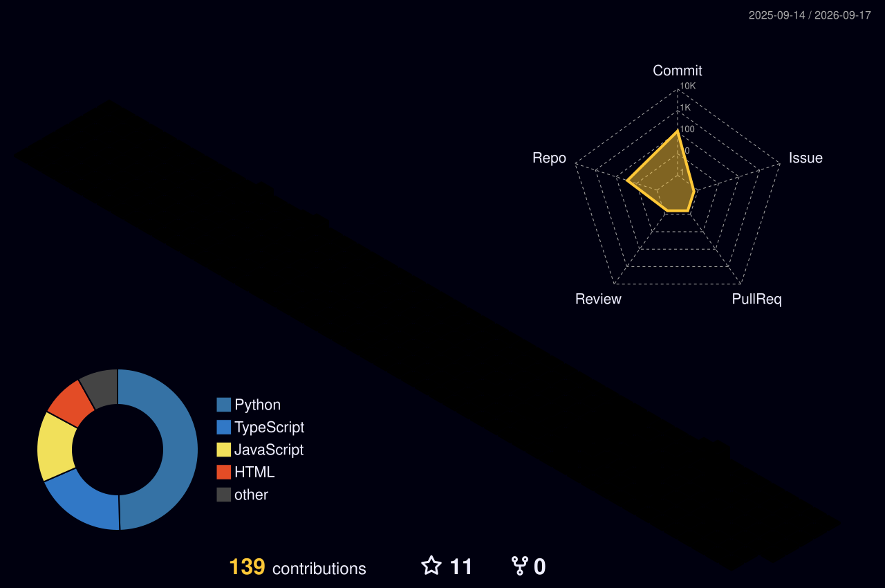

# 
🌌 Welcome to my Digital Universe 🌌

  

  
  

 

  
  

 

## 
🐍 The Contribution Odyssey

  

 

<table border="0">
  <tr>
    <td width="55%" valign="top">
      <h3> 🧠 The Architect's Mind</h3>
      
I build <b>Intelligent Systems</b> that bridge the gap between complex data and elegant solutions. Currently specializing in <b>CSE (AI)</b> and pushing the boundaries of what's possible in the digital realm.

      <ul>
        <li>🚀 <b>Elite Roles:</b> Data Analyst @ <b>Deloitte</b> | Software Engineer @ <b>JPMorgan</b></li>
        <li>💡 <b>Focus:</b> Generative AI, Predictive Modeling, & Scalable Full-Stack Architectures.</li>
        <li>🏆 <b>History:</b> Multi-Hackathon Runner-up & Tech Innovator.</li>
      </ul>
       
      <h3> 🛠️ Master Arsenal</h3>
      

        
        
        
        
        
        
      

    </td>
    <td width="45%" valign="top">
      <h3> 🏆 Hall of Fame</h3>
      

        
      

    </td>
  </tr>
</table>

 

---

## 
🗓️ Isometric Contribution Spacetime

  

---

 

  

 

  

  <b><i>"Synthesizing data into reality, one pixel at a time."</i></b>

